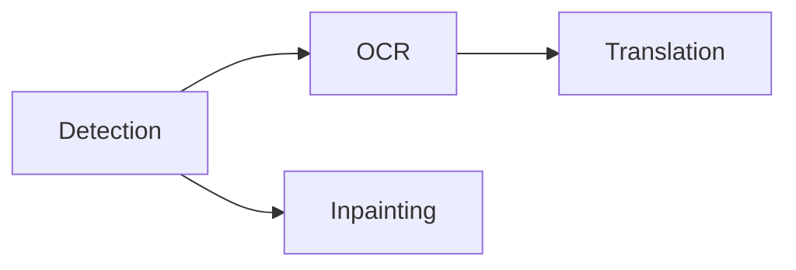

The processing selector above the canvas controls the page scope and stages. Start with the smallest scope that covers the work.

## Choose a scope

<Tabs>
  <Tab title='Current page'>Process the page currently shown on the canvas.</Tab>
  <Tab title='Selected pages'>Process the pages selected in the page rail.</Tab>
  <Tab title='Entire project'>Process every page in project order.</Tab>
  <Tab title='Selected text'>
    Use the **Process** menu's selected-layer OCR or translation action after editing or adding a
    few text elements.
  </Tab>
</Tabs>

## Choose stages

Select any non-empty set of stages, then choose **Run**. Selected stages follow this dependency order:

Detection creates regions and removal masks. OCR reads those regions. Translation writes target text. Inpainting reconstructs artwork under the lettering.

<Note>
  Omitted prerequisites are not added automatically. Include detection or OCR when a later stage
  needs fresh input. **Run through Inpainting** means detection plus inpainting; it does not include
  OCR or translation.
</Note>

The **Process** menu also offers **Run through Detection**, **OCR**, and **Translation** for common stage groups.

## Follow progress and stop work

Only one processing job runs at a time. The activity center shows the page, stage, model, completed work, and failures.

Each stage commits when it finishes. Completed work remains available if a later stage fails. Stopping prevents new work from starting; a native call already in progress returns at a safe boundary. Its result is discarded if stop was requested before the commit.

Stages with no applicable input complete without inference. A page with no detected text does not need OCR or translation.

<Warning>
  Rerunning a derived stage replaces its output in the selected scope. Review manual corrections
  before rerunning detection or OCR over the same elements.
</Warning>

Continue with [text review](/en/guides/review) or [cleanup](/en/guides/cleanup).
