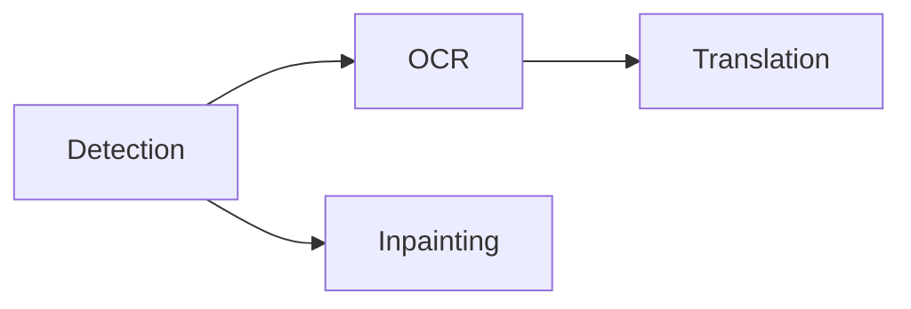

The processing selector above the canvas controls the page scope and stages. Start with the smallest scope that covers the work.

## Choose a scope

<Tabs>
  <Tab title='Current page'>Process the page currently shown on the canvas.</Tab>
  <Tab title='Selected pages'>Process the pages selected in the page rail.</Tab>
  <Tab title='Entire project'>Process every page in project order.</Tab>
  <Tab title='Selected layers'>
    Choose **Process → Process Selected Layers** after editing or adding a few text elements. It
    runs OCR and translation on the selected layers only.
  </Tab>
</Tabs>

## Choose stages

Select any non-empty set of stages, then choose **Run**. Selected stages follow this dependency order:

Detection creates regions and removal masks. OCR reads those regions. Translation writes target text. Inpainting reconstructs artwork under the lettering.

<Note>
  Omitted prerequisites are not added automatically. Include detection or OCR when a later stage
  needs fresh input. **Run Inpainting** means detection plus inpainting; it does not include OCR or
  translation.
</Note>

The **Process** menu also offers **Process Project**, **Process Selected Pages**, and **Run Detection**, **Run OCR**, **Run Translation**, and **Run Inpainting**. A **Run** item runs every stage up to the named one and always covers the entire project, regardless of the scope selector.

## Follow progress and stop work

Only one processing job runs at a time, and pages cannot be imported while one is running. The activity center shows the stage, model, progress, and failures.

Each stage commits when it finishes. Completed work remains available if a later stage fails. Stopping prevents new work from starting; a native call already in progress returns at a safe boundary. Its result is discarded if stop was requested before the commit.

Stages with no applicable input complete without inference, although the model is still loaded first. A page with no detected text does not need OCR or translation.

<Warning>
  Rerunning a stage does not discard your edits. Detection skips any page that already has a text
  region, so delete the existing regions to detect a page again. OCR and translation replace
  generated text but keep source text and translations you edited. Inpainting skips a page that
  already has a cleanup layer unless you paint a new **Remove** mask.
</Warning>

Continue with [text review](/en/guides/review) or [cleanup](/en/guides/cleanup).

## Project workflow presets and terminology

Enable **Settings → Pipeline → Use project workflow for Run All** and choose a preset. Entire-project and multi-page Run All actions, including the Process menu, then use that preset. Disabling the switch preserves standard page-major processing; single-page and individual-stage actions stay unchanged. Use **Process → Workflow presets** to edit presets or run one directly. **Standard** preserves the existing scheduling behavior. **Consistent Project Translation** finishes detection across the scope, then OCR, terminology analysis and review, translation, and finally inpainting. Each stage waits for all target pages to finish. Choose the entire project or selected pages; save a named preset to retain its scope, scheduling, stages, and review setting.

Terminology analysis reads existing OCR text one page at a time. It combines repetition and cross-page counts with Japanese surname, katakana, compound, title, and organization cues. It normalizes Unicode and punctuation, deduplicates terms, and retains at most 5000 candidates. Extraction does not call an LLM. In the candidate list, **AI fill missing translations** uses the configured translation model and target language in batches of up to 24 terms and 4096 source bytes. It preserves existing translations and supports stopping after the current batch. Review, confirm, and save the suggestions afterward. Turning review off skips analysis; it never silently confirms candidates.

The editor toolbar **Project glossary** button (also available under **Process**) contains **Confirmed** and **Candidates**. Edit source, target, category, notes, and enabled state; add or delete entries manually. Candidates show occurrence and page counts. Fill in a translation and confirm individually, or confirm all candidates with translations. Ignored candidates stay excluded from later analysis. Saved candidate translations survive reanalysis.

When the workflow pauses, select **Save and continue translation** after review. You can leave some candidates unconfirmed; only enabled confirmed terms apply. Activity retains each stage's status and page count and offers review and stop controls. To rerun after cancellation or failure, choose only the remaining stages; completed scene edits remain saved.

The glossary belongs to the native project and participates in undo/redo. Switching providers does not remove it. JSON export supports reuse across projects; import merges confirmed entries and rejects conflicting source terms without changing the project.

Translation batches receive only matching glossary entries, with longer source matches taking precedence. Local and hosted language models share the same consistency instructions. For DeepL, Google Cloud Translation, and Caiyun, confirmed spans are preserved while surrounding fragments are translated; this guarantees those targets but gives the service less sentence context. Review the result when grammatical reordering matters.
