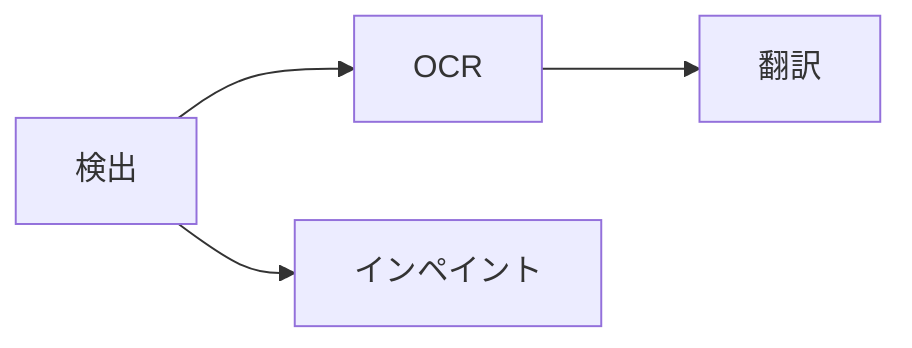

## 固定パイプライン

`koharu-pipeline` の実行単位は 1 ページの 1 段階です。

ページはプロジェクト順に入り、検出が終わったページの後続処理はすぐ実行可能になります。全ページの検出完了は待ちません。

各段階は意味パッチを返します。アプリは結果をコミットしてキャンバスを同期し、1 回の実行のリビジョンを 1 つの undo にまとめます。

## 常駐と停止

アクセラレーター推論は 1 本の実行レーンを使います。異なる推論の重なりは、代表入力で計算とメモリ帯域の競合を起こし、速度を下げたためです。CPU 専用処理はモデル別レーンを保持できます。

モデルは必要時にロードして再利用します。常駐・ピーク作業メモリを追跡し、安全余裕を確保し、古く使われていないモデルから解放します。学習済みのメモリ不足ケースではクリーンアップ後に一度再試行します。

停止要求後は新しい段階を開始しません。実行中のネイティブ推論は安全に戻り、未コミット結果を破棄します。

## 保持フレームを準備する

`koharu-renderer::Renderer` はスナップショットとページ ID から不変の `Frame` を作ります。順序付きレイヤー、エンティティ検索、表示メタデータ、依存、診断、ベクターシーンを持ち、ブラウザー表示とネイティブ読み戻し用の `koharu-rasterizer` バンドルを準備します。

見える文字は訳文だけです。組版、フィット関係、フォント、画像、表示、不透明度はシーンから取得し、呼び出し側は別の文書モデルを渡しません。

<Note>
  WebGPU、PNG、レイヤー切り出し、PSD
  は同じ準備済みフレームを使います。差分再利用でも全体描画と同じ結果が必要です。
</Note>

## ブラウザーに表示する

Tauri CEF WebView が表示面を所有します。React は UI、WASM にコンパイルされた `koharu-canvas` は `HTMLCanvasElement` の WebGPU 描画を担当します。カメラ、変形プレビュー、ストローク、サンプリングはブラウザー内の一時状態で、完了した編集だけが Tauri コマンドを通ります。

<Steps>
  <Step title='世代を公開する'>ページ変更は軽量マニフェストの要求前に世代を通知します。</Step>
  <Step title='不足リソースを取得する'>
    キャンバスは不足する内容 ID を報告し、非同期にリソースを受け取ります。
  </Step>
  <Step title='完全なフレームへ切り替える'>
    準備が整うまで以前のページを表示します。古い準備や要求は新しい世代を上書きできません。
  </Step>
</Steps>

ラスターは論理 1024 ピクセルのタイルと、内部辺の 1 ピクセルのサンプリング余白を使います。これによりフィルター境界を保ち、WASM コピーと GPU テクスチャを制限します。CPU/GPU キャッシュの連携で、再訪時の変更されていないリソースの転送とアップロードを避けます。

## 最終表示を確認する

アダプター、デバイス喪失、サイズ、表示倍率は WebView に依存するため、最終 Tauri ウィンドウで見た目を確認します。ネイティブ PNG/PSD は共通の読み戻し経路を検証します。

debug ビルドの CEF は `http://127.0.0.1:4000` を公開します。DOM とキャンバスのライフサイクルには意味的な CDP 検査、最終画素にはネイティブウィンドウキャプチャを使います。
