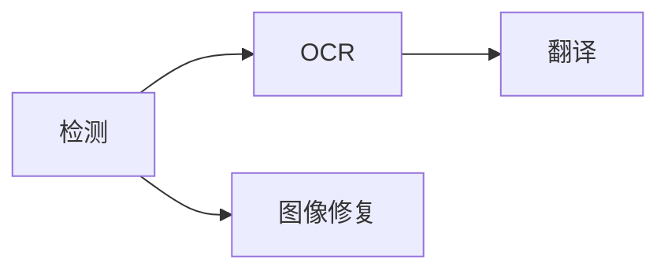

画布上方的处理选择器控制页面范围与阶段。从能覆盖任务的最小范围开始。

## 选择范围

<Tabs>
  <Tab title='当前页面'>只处理画布正在显示的页面。</Tab>
  <Tab title='选中页面'>处理页面栏中选择的页面。</Tab>
  <Tab title='整个项目'>按项目顺序处理全部页面。</Tab>
  <Tab title='选中文本'>
    修正或新增少量文字后，使用**处理**菜单中针对选中图层的 OCR 或翻译操作。
  </Tab>
</Tabs>

## 选择阶段

选择至少一个阶段，再点击**运行**。已选阶段遵循以下依赖顺序：

检测创建区域与移除蒙版，OCR 读取区域，翻译写入目标文本，图像修复重建原文字迹下方的画面。

<Note>
  省略的前置阶段不会自动补上。后续阶段需要新输入时，请同时选择检测或
  OCR。**运行至图像修复**只包含检测和图像修复，不包含 OCR 与翻译。
</Note>

**处理**菜单也提供运行至检测、OCR 或翻译的常用组合。

## 查看进度与停止

同一时间只有一个处理任务。活动中心显示页面、阶段、模型、完成情况与错误。

每个阶段完成后立即提交。后续阶段失败不会移除已完成结果。停止会阻止新工作开始；已经运行的原生调用在安全边界返回。若提交前收到停止请求，该结果会被丢弃。

没有适用输入的阶段无需推理即可完成。未检测到文字的页面不需要 OCR 或翻译。

<Warning>
  重跑派生阶段会替换所选范围内的结果。对相同元素重跑检测或 OCR 前，请先检查手动修正。
</Warning>

继续[检查文字](/zh/guides/review)或[清理原文](/zh/guides/cleanup)。
