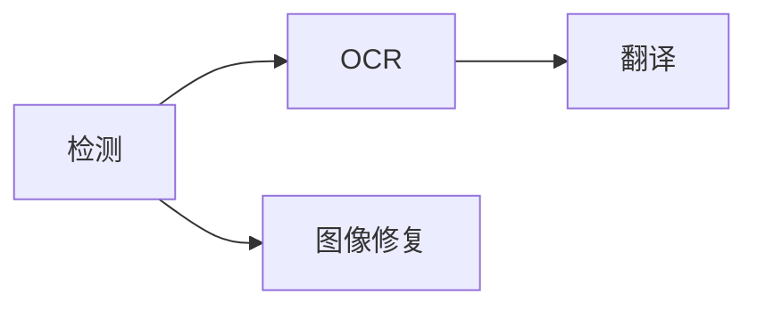

画布上方的处理选择器控制页面范围与阶段。从能覆盖任务的最小范围开始。

## 选择范围

<Tabs>
  <Tab title='当前页面'>只处理画布正在显示的页面。</Tab>
  <Tab title='选中页面'>处理页面栏中选择的页面。</Tab>
  <Tab title='整个项目'>按项目顺序处理全部页面。</Tab>
  <Tab title='选中图层'>
    修正或新增少量文字后，选择**处理 → 处理所选图层**。它只对选中的图层运行 OCR 和翻译。
  </Tab>
</Tabs>

## 选择阶段

选择至少一个阶段，再点击**运行**。已选阶段遵循以下依赖顺序：

检测创建区域与移除蒙版，OCR 读取区域，翻译写入目标文本，图像修复重建原文字迹下方的画面。

<Note>
  省略的前置阶段不会自动补上。后续阶段需要新输入时，请同时选择检测或
  OCR。**运行修补**只包含检测和图像修复，不包含 OCR 与翻译。
</Note>

**处理**菜单也提供**处理项目**、**处理所选页面**，以及**运行检测**、**运行OCR**、**运行翻译**和**运行修补**。**运行**类菜单项会执行到指定阶段为止的所有阶段，并且始终覆盖整个项目，与范围选择器无关。

## 查看进度与停止

同一时间只有一个处理任务，任务运行期间无法导入页面。活动中心显示阶段、模型、进度与错误。

每个阶段完成后立即提交。后续阶段失败不会移除已完成结果。停止会阻止新工作开始；已经运行的原生调用在安全边界返回。若提交前收到停止请求，该结果会被丢弃。

没有适用输入的阶段无需推理即可完成，但模型仍会先被加载。未检测到文字的页面不需要 OCR 或翻译。

<Warning>
  重跑阶段不会丢弃你的编辑。检测会跳过已有文字区域的页面，要重新检测请先删除现有区域。OCR
  和翻译会替换生成的文本，但保留你编辑过的原文和译文。图像修复会跳过已有清理图层的页面，除非你绘制了新的**移除**蒙版。
</Warning>

继续[检查文字](/zh/guides/review)或[清理原文](/zh/guides/cleanup)。

## 项目工作流预设与术语表

在**设置 → 流水线 → 启用项目工作流**打开开关，并选择预设。之后工具栏选择**整个项目**或多页选择再完整运行，以及菜单中的项目/多页完整运行，都会使用该预设。关闭开关保留原来的逐页流程；单页和单独阶段操作不受影响。也可以打开**处理 → 工作流预设**单次运行或编辑预设。**Standard** 保留现有调度行为。**Consistent Project Translation** 依次完成范围内所有页面的检测、OCR、术语分析与审核、翻译，最后进行图像修复。每个阶段都等待全部目标页面完成。可选整个项目或选中页面；保存命名预设会保留范围、调度方式、阶段和审核设置。

术语分析逐页读取已有 OCR 文本，综合出现频次、跨页次数、日本姓氏、片假名、复合词、称号和组织特征。它会进行 Unicode 与标点规范化、去重，最多保留 5000 个候选；提取阶段不调用 LLM。候选列表中的 **AI 填写空白译文** 使用当前翻译模型和目标语言分批生成建议；每批最多 24 个词、4096 字节原文，保留已有译文，支持停止后续批次。生成后仍需确认并保存。关闭审核会跳过分析，不会自动确认候选。

**处理 → 项目术语表**包含**已确认**和**候选项**。已确认条目支持手动增删、修改原文、译文、分类、备注和启用状态。候选显示出现次数和页数；填写译文后可逐项确认，或批量确认所有已填写译文的候选。忽略的条目不会在后续分析中重新出现；已保存的候选译文会在重新分析时保留。

术语审核阶段会自动打开术语表，也可随时点击编辑器工具栏的**项目术语表**。工作流暂停后，审核并点击**保存并继续翻译**。可以保留未确认候选，只有启用的已确认术语会用于翻译。活动中心保留各阶段的状态与页数，并提供审核和停止入口。取消或失败后，可在预设中只勾选剩余阶段重跑；已提交的页面结果会保留。

术语表随原生项目保存，支持撤销/重做，不因切换翻译服务而丢失。JSON 导出可跨项目复用；导入合并已确认条目，发现原文相同但内容冲突时会报错，不修改项目。

每批翻译只注入匹配术语，较长原文优先。本地与云端语言模型使用共享的一致性指令。DeepL、Google Cloud Translation 和彩云采用保留确认术语、翻译周围片段再组合的方式，能保证术语译文，但会减少服务可见的整句上下文；涉及语序变化时应检查结果。
